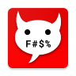

<div align="center">
  
  <h1>Sms Bomber</h1>
</div>

### Dependencies:
- [react-native-sendsms](https://github.com/robiXxu/react-native-sendsms)
- [react-native-permissions](https://github.com/robiXxu/react-native-permissions)

### Up and running
Clone the repo
```
git clone git@github.com:robiXxu/smsBomber.git
```
Cd into smsBomber folder then run:
```
npm install
```


### TODO
- [ ] find a way to add the same functionality for IOS 


### Releases 
> You can find the latest release [here](https://github.com/robiXxu/smsBomber/releases)

> I tried to put this up on Google Play but they suspended the app before realsing on SPAM reasons

> Seems like a double standards after seeing similar apps that are already on the market. https://goo.gl/nDGeS8